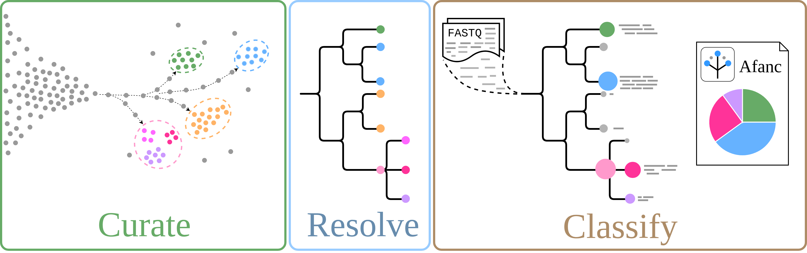
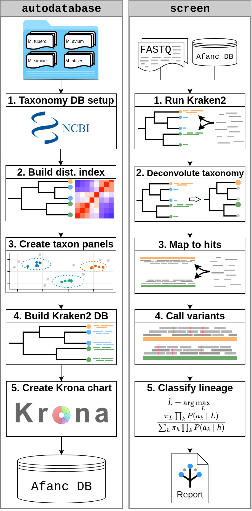

<p align="center">
  
</p>

# Taxonomic Deconvolution and Probabilistic Lineage Classification

| | |
| --- | --- |
| Author  | Arthur Morris ([ArthurVM](https://github.com/ArthurVM/)) |
|         | Anna Price ([annacprice](https://github.com/annacprice/)) |
| Email   | <arthurvmorris@gmail.com> |
| License | [GNU GPL v3.0](https://opensource.org/license/gpl-3-0/) |

## Description
A toolkit for performing variant-level metagenomic deconvolution of NGS reads.

Current version: `0.20`



## Installation

The recommended installation route is the conda recipe. Afanc depends on a
number of non-Python bioinformatics tools, and the recipe is the easiest way to
install Afanc together with those runtime dependencies.

### Recommended: build and install with conda

From a clone of this repository:

```bash
git clone https://github.com/ArthurVM/Afanc.git
cd Afanc

# Install conda-build if it is not already available.
conda install -n base -c conda-forge conda-build

# Build the local package recipe.
conda build -c conda-forge -c bioconda conda.recipe

# Create a fresh Afanc environment from the locally built package.
conda create -n afanc -c local -c conda-forge -c bioconda afanc
conda activate afanc

afanc --help
```

`mamba` can be used in place of `conda` for the environment creation step if
you prefer faster dependency solving:

```bash
mamba create -n afanc -c local -c conda-forge -c bioconda afanc
```

### Development install

For development, create the supplied environment and install the local checkout
in editable mode:

```bash
git clone https://github.com/ArthurVM/Afanc.git
cd Afanc
conda env create -f environment.yml
conda activate afanc
python -m pip install -e .
pytest -q tests/unit_tests
```

### Pip-only install

Pip can install the Python package, but it will not install external command
line tools such as Kraken2, Mash, BWA, Samtools, Krona, FreeBayes, or
bcftools. Use this only if those tools are already installed and available on
`PATH`.

```bash
git clone https://github.com/ArthurVM/Afanc.git
cd Afanc
python -m pip install .
```

### Sub-Modules
Afanc is split into four command-line submodules:
```
  get_dataset         Download a dataset of genome assemblies from GenBank.
  autodatabase        Generate a screening database from a FASTA directory structure.
  screen              High-resolution metagenomic screening of short read data using a database
                      constructed by autodatabase.
  classify            Classify lineage directly from an existing VCF or allele JSON using
                      the same profile models used by screen.
```

The lineage classifier itself lives in the shared `Afanc.classifier` package,
so `screen` and `classify` use the same Bayesian classification implementation.

At a high level, these modules form a complete workflow:

<p align="center">
  
</p>

1. `get_dataset`: read a line-separated list of species names, query NCBI Datasets for complete, latest GenBank assemblies, rank available assemblies by scaffold N50, and download the requested number of genomes into an Afanc-compatible directory structure.
2. `autodatabase`: turn that FASTA directory structure into an Afanc screening database by preparing taxonomy files, assigning taxids to FASTA records and filenames, running Mash-based assembly quality control, building a Kraken2 database, generating the Mash Variant Index used during read redistribution, producing a Krona database-composition report, and writing an assembly manifest workbook.
3. `screen`: screen paired-end reads against an Afanc database with Kraken2, parse and filter the Kraken2 report into candidate species/variant hits, optionally stop after taxonomic screening, otherwise recover the relevant database assemblies, perform competitive BWA mapping against the detected hits, generate mapping/statistical reports, call SNPs with FreeBayes or bcftools, run Bayesian lineage classification where profile models are available, and write the final JSON report plus a Krona screen report.
4. `classify`: classify lineage from pre-existing variant evidence by resolving a species/profile model, confirming the input was generated against the profile reference, converting the evidence into Afanc SNP JSON, and running the shared Bayesian classifier.

### get_dataset
This is a general ease-of-use module for preparing FASTA input for `autodatabase`.
The user provides a line-separated list of species names (e.g.
`Escherichia coli`) and Afanc queries NCBI Datasets for complete, latest,
non-atypical GenBank assemblies with an exact taxon match. The available
assemblies are ranked by scaffold N50 and the requested number of genomes is
downloaded for each species.

The `--accessions` mode is retained in the command-line interface, but accession
downloads are deprecated in the current implementation. Use species names for
new datasets.

Given the text file
```
Pseudogenus hominis
Pseudogenus hominis variant 1
Pseudogenus avium
Pseudogenus simium
```
the directory structure will be
```
.
|
├── Pseudogenus_avium
│   ├── assembly_1.fa
│   ├── assembly_2.fa
│   └── assembly_3.fa
├── Pseudogenus_simium
│   ├── assembly_1.fa
│   ├── assembly_2.fa
│   └── assembly_3.fa
└── Pseudogenus_hominis
    ├── assembly_1.fa
    ├── assembly_2.fa
    ├── assembly_3.fa
    └── Pseudogenus_hominis_variant_1
        ├── assembly_1.fa
        ├── assembly_2.fa
        └── assembly_3.fa
```
For current releases, provide species names rather than accessions.

### autodatabase
Autodatabase automates the process of constructing a Kraken2 database. This is a pythonic reimagination of the nextflow pipeline https://github.com/annacprice/autodatabase

This module takes a directory structure as described in above, in the get_dataset section. It must contain directories for each species level taxon, where subdirectories within each species directory pertain to subspecies/variants/strains, or any other taxonomic rank lower than species (hereafter referred to simply as variants).

The current workflow is:

    1) Download the requested NCBI taxonomy, or use a supplied local taxonomy dump
    2) Resolve or add taxonomic IDs for input species/variants and rewrite FASTA headers/filenames
    3) Run Mash all-vs-all distance checks within each taxon
    4) Select high-quality assemblies around the taxon distance mode, or keep all assemblies for taxa with fewer than three samples
    5) Build and inspect the Kraken2 database from the quality-controlled assemblies
    6) Build the Mash Variant Index used by `screen` for variant-level read deconvolution
    7) Create a Krona HTML report showing database composition
    8) Create an assembly manifest workbook describing provided assemblies, tax IDs, final database inclusion/rejection, QC status, and Mash distance metrics where available

By default, it will use the NCBI taxonomy from `2026-05-01`. If a species or variant is not found within the NCBI taxonomy database, Afanc will attempt to add it to the database and assign it an NCBI taxonomy ID.

The assembly manifest is written to `<output_prefix>/<output_prefix>.manifest.xlsx`.
It contains spreadsheet tabs for per-assembly decisions, per-taxon summaries,
and run-level counts. The per-assembly sheet records the original input FASTA,
normalised taxon, tax ID, rewritten FASTA name, whether the assembly was included
in the final database, the inclusion/rejection reason, QC status, final database
path where relevant, and Mash distance metrics where available.

### screen
This module takes a database produced by the autodatabase module, and paired end read data in .fastq format, and performs metagenomic analysis upon it. It produces a report in .json format.

The current workflow is:
  
    1) Run Kraken2 on paired-end reads
    2) Parse and filter the Kraken2 report using the configured read and percentage thresholds
    3) Generate a Krona HTML report from the filtered screen report
    4) If `--no_map` is set, stop after taxonomic screening and write the final report
    5) Retrieve the assemblies associated with detected hits from the local Afanc database
    6) Build a combined reference and perform competitive BWA mapping against the hit assemblies
    7) Generate per-hit mapping reports and BAM indexes
    8) Call SNPs from the mapped reads with FreeBayes or bcftools and write classifier-ready SNP JSON
    9) Run Bayesian lineage classification when a matching profile model is available
    10) Write the final taxid-indexed JSON report, including taxonomic assignment, mapping statistics, SNP profiles, lineage profiles, and subreport files

### classify
This module performs lineage classification from existing variant evidence
without running the full `screen` workflow. It resolves the supplied species
name against `profiles.json`, checks that a model and reference FASTA are
available, validates that the input evidence is compatible with the profile
reference, and writes SNP JSON plus lineage classification reports. If the
species/profile name is not supported, Afanc reports the supported profile names
so the user can choose a valid reference.

Profiles can be discovered from `<database>/profiles` with `--database`, or from
an explicit profile directory with `--profiles-dir`. The directory must contain
`profiles.json` and the referenced model/reference files.

VCF input is the default user-facing route:

```bash
afanc classify \
  --species "Mycobacterium tuberculosis" \
  --vcf sample.vcf \
  --database my_assemblies_DB \
  -o sample
```

The VCF must have been generated from alignment against the profile reference
FASTA. Afanc checks `##contig` headers with lengths and validates simple SNP REF
alleles against that FASTA before classification. VCF records are filtered with
the same SNP filtering parameters and defaults used by `screen`, so VCF-based
classification does not have a separate filtering policy. If a samtools
depth-style file is supplied, low-depth positions are included as missing
evidence:

```bash
afanc classify \
  --species "Mycobacterium tuberculosis" \
  --vcf sample.vcf \
  --depth-bed sample.depth.bed \
  --database my_assemblies_DB \
  -o sample
```

For integration with ARDAL-style infrastructure, `classify` can also consume a
JSON object with `allele` or `alleles` and `missing` fields. Missing positions
may be `[chrom, pos]` pairs or `chrom.pos` strings:

```json
{
  "allele": ["chr1.761155.C.T", "chr1.1473246.G.A"],
  "missing": [["chr1", "12345"]]
}
```

This mode is deliberately explicit and requires an allele ID format:

```bash
afanc classify \
  --species "Mycobacterium tuberculosis" \
  --allele-json sample.alleles.json \
  --allele-id-format "{chrom}.{pos}.{ref}.{alt}" \
  --database my_assemblies_DB \
  -o sample
```

The allele ID format must include `chrom`, `ref`, `alt`, and either `pos` or
`start`. The `ref` field is mandatory because Afanc must be able to verify
reference correctness before running the classifier; classification fails if the
format does not contain a reference allele field.

For an output prefix of `sample`, `classify` writes:

```text
sample.snps.json
sample.lineage_classification.json
sample.classify.json
```

The SNP JSON is the normalised Afanc evidence payload, the lineage
classification JSON is the direct classifier output, and the classify summary
records the input type, reference-validation results, resolved profile, SNP and
missing counts, and top-level classification call.
    
## Running Afanc

Running Afanc should, in general, be done in the order of modules presented above. The `get_dataset` module is not necessary if you already have genome assemblies in the directory structure outlined previously.

### Step 1: Create Assembly Directory
```
  afanc get_dataset species_list.txt -n 5 -o my_assemblies_dir
```
This will create a directory structure containing up to 5 (if enough are available on GenBank) assemblies of each species/variant downloaded from GenBank. This can then be fed into the autodatabase module

### Step 2: Create a Database
```
  afanc autodatabase my_assemblies_dir -o my_assemblies_DB
```
This will create a directory structure, which constitutes the database for screening reads against.

### Step 3: Screen Reads
```
  afanc screen my_assemblies_DB my_reads_1.fq.gz my_reads_2.fq.gz -o my_analysis
```
Results will be deposited in a directory structure within `my_analysis`.

### Optional Step 4: Classify Existing Variant Calls
If variant calls have already been generated against a supported profile
reference, they can be classified without rerunning the full screen workflow:

```
  afanc classify --species "Mycobacterium tuberculosis" --vcf sample.vcf --database my_assemblies_DB -o sample
```

This is intended for existing VCFs or ARDAL-style allele JSON payloads, not as a
replacement for `screen` when starting from read data.

## Dependencies

Afanc requires Python `>=3.10,<3.13` and several external bioinformatics
programs. The conda recipe installs these dependencies automatically where
available, which is why it is the preferred installation method.

Core runtime dependencies include:

```text
Python >=3.10,<3.13
Biopython
NumPy
Pandas
OpenPyXL
Pysam
SciPy
bcftools
bedtools
BLAST+
Bowtie2
BWA
curl
Entrez Direct E-utilities
FreeBayes
Kraken2
Krona
Mash
NCBI Datasets CLI
GNU parallel
Perl
rsync
samclip
samtools
unzip
wget
```

If you do not use the conda recipe, make sure all command line tools are
installed separately and available on `PATH`.

### Entrez Direct
Install instructions for Entrez Direct E-utilities can be found at https://www.ncbi.nlm.nih.gov/books/NBK179288/

### NCBI Datasets
Install instructions for ncbi datasets can be found at https://www.ncbi.nlm.nih.gov/datasets/docs/v2/download-and-install/

### Mash
```
  wget https://github.com/marbl/Mash/releases/download/v2.3/mash-Linux64-v2.3.tar \
  tar -xf mash-Linux64-v2.3.tar \
  mv mash-Linux64-v2.3/mash /usr/local/bin \
```

### ncbi-blast+
```
  apt-get update
  apt-get install ncbi-blast+
```

### Kraken2
```
  https://github.com/DerrickWood/kraken2/archive/refs/tags/v2.1.2.tar.gz
  wget https://github.com/DerrickWood/kraken2/archive/refs/tags/v2.1.2.tar.gz \
  tar -xzf v2.1.2.tar.gz \
  cd kraken2-2.1.2 \
  ./install_kraken2.sh /usr/local/bin
```

### Krona
```
  git clone https://github.com/marbl/Krona \
  mkdir -p Krona/KronaTools/taxonomy \
  cd /Krona/KronaTools \
  ./install.pl \
  ./updateTaxonomy.sh
```

### Bowtie2
```
  curl -fsSL https://sourceforge.net/projects/bowtie-bio/files/bowtie2/${bowtie2_version}/bowtie2-2.3.4.1-source.zip -o bowtie2-2.3.4.1-source.zip
  unzip bowtie2-2.3.4.1-source.zip 
  make -C bowtie2-2.3.4.1 prefix=/usr/local install
  rm -r bowtie2-2.3.4.1
  rm bowtie2-2.3.4.1-source.zip
```

### Citation
https://www.biorxiv.org/content/10.1101/2023.10.05.560444v1
